# Tiny Image in JavaScript : Mathematical Morphology

Vincent DEJONGHE, Adrien MENDES SANTOS, Rodolphe TWOREK\*

Link to Github : https://github.com/ReiNoIkari/Morphological-Image-Processing

## Introduction
Nowadays, scientists have access to huge image databases which can make studying organisms easier. One problem still persist : those collected datas are worthless if they are not interpreted and the concern is that a lifetime won't be enough for a scientist to follow the flow. That’s were informatics come in order to help to analyse those huge amount of raw data, and in our case more precisely Image Processing. Indeed, the developement of some Image processing tool made that easier to computerize and analyse [^GON1992],[^JAI1989].

Mathematical morphology has been invented in 1964 by Georges Matheron and Jean Serra in the MINES ParisTech's laboratories. Its development was always motivated by industrial application. At the begining, the main purpose was to answer issues in the mining exploitation field. Then this purpose diversified itself to biology, medical imagery, material science, industrial vision, multimedia, teledetection, geophisic, etc. It consist in a mathematical and informatical theory and technique which is linked with algebra, the lattice theory, topology and probabilities [^SCH1993].

Currently, one of the mathematical morphology’s main field is Image Processing. It particularly allows to use filtering, segmentation and quantification tools. Since it’s emergence in 1964, it knows a growing success and constitutes a part of many Image Processing softwares yet.

For the purposes of object identification required in industrial vision applications, the operations of mathematical morphology are more useful than the convolution operations employed in signal processing because the morphological operators relate directly to shape.
For this second step corresponding to the Javascript implementation, we had to make our own implementation of the morphological operators (erode, dilate, close, open, hit or miss, watershed and skeletonized) related to the Literature Search.
In this report, we will focus on describe in detail each function in the Material & Methods part. We will then present our results with the use of the same input image sample, followed by a comparison about our implementation and the ImageJ processes. Finally, we will discuss about our work and some possible improvements.

## Material & Methods
Each of our functions is built with the same way. We can note the presence of an equivalent of a main function usually associated with the name of the morphological operation, that calls all our secondaries functions used to process the different steps.
Another thing to note is that most of our functions use an intermediate value of 2. Indeed, we set each pixels values at given times pixel by pixel, which would interfere with the global image’s remaining treatment and falsify our results. The primary function will thus set an intermediate value if needed, and then an intermediate function will exchange those intermediate value by the correct ones.

### Erosion

As a reminder, erosion is one of two fundamental operations (the other being dilation) in morphological image processing from which all other morphological operations are based. It was originally defined for binary images, later being extended to grayscale images, and subsequently to complete lattices. Our part of the project (Morphological operation) is focused on binary images, hence the implementation of our erosion (and most of our operations) are based in some binary property like the fact that a pixel can only be in two state : foreground (it’s value thus corresponding to 255) and background (it’s value thus corresponding to 0).

The erosion operation was implemented in Javascript using a candid approach which is the definition itself of an erosion. An erosion is defined as follow by wikipedia (for further details refer to the report from step 1) :

*Let E be a Euclidean space or an integer grid, and A a binary image in E. When the structuring element B has a center, and this center is located on the origin of E, then the erosion of A by B can be understood as the locus of points reached by the center of B when B moves inside A. For example, the erosion of a square of side 10, centered at the origin, by a disc of radius 2, also centered at the origin, is a square of side 6 centered at the origin.*

To rephrase it with our own word, when a structuring element fits our image (i.e. when all foreground pixels values in the structuring element corresponds to their counterpart in our image), then all the others pixels are turned off except for the center pixel.

To summarize this approach, we had to convert our two images (the one we are working on, and the kernel image) in their raster so we could work more easily with predefine properties. From this point, we had to parse our entire image using the kernel. For each pixel in the original image that have the same value as the center pixel of our kernel, the concordance between the neighbourhood of the center structuring element’s pixel and its counterpart in the image are checked. If those neighbourhoods fits, we just needed to light off the neighbours pixels and return an eroded image.

The main function of the erode process is *erode()* and takes as input 2 parameters, the first one is the image that have to be processed, the second argument if an image of the structuring element to apply in order to erode the image. This functions acts like a main, in the regard that apart from creating a copy of the original image (so we don't work in the original one) it will call two functions : *erode_process()* and *process_operation_erode()*.

The *erode_process()* function is acting as follows:

The first step if to determine the number of the foreground pixels that are present in our kernel, we use for this the map function in such a way that we scan all the kernel and if a pixel has a value of 255 linked with a counter called "values_foreground”.

Then, we iterate in height and width the raster from the source image, and we fix an other counter named "values" to 0. This variable will have the same goal as the previous one: it will allow us to determine the number of foreground pixels in the raster (we will come back to it later by describing the second function).

From here, for each values in height and width, the concordance between the pixel value associated to this coordinates and the one from the center pixel of our kernel is checked. If the case those values are fitting, the concordance of neighbourhood between kernel and its related is checked using the radius of the kernel. 

If the pixel value from the coordinates of a lenght of minus the radius of the kernel and the radius of the kernel is 255, we add a +1 to our variable "values”. If “values” and "values_foreground" have the same values, the foreground pixels of the kernel have an exact match with the pixels of the raster of the image. As a consequence we set for those coordinates a value of 2. We then return the raster with containing those intermediate pixels.

The *process_operation_erode()* function is the intermediate function we talked earlier. It will iterate through the raster in heigh and width, and in the case of erosion, change all the pixels with a value of 2 to foreground pixel value (255), and all the other pixels will be set to background pixel ones (0). It returns the final raster containing the good pixel values.

The *erode()* function is then in charge to call those two functions, and return the eroded image that will be displayed.

### Dilation

As said in the erosion part, dilation is the other fundamental operations (the first one being erosion) in morphological image processing from which all other morphological operations are based. The same way as the erosion, the dilation was implemented in a naive way, using the definition itself. If we refer to Wikipedia, the dilation definition is as follows:

*Let E be a Euclidean space or an integer grid, A a binary image in E, and B a structuring element regarded as a subset of Rd. If B has a center on the origin, then the dilation of A by B can be understood as the locus of the points covered by B when the center of B moves inside A.*

A great part of the procedure is really similar to the erode process. We will once more iterate through the entire image but this time we won't need to use counters. However, reversely as erosion, we will have to take care of one problem we encountered: the treatment of the image’s boundaries. Since the dilation and the erosion are two close operators, the code and our approach for those two operators are very similar.

The main function of the dilate process is *dilate()* and takes as input 2 parameters. The first one is the image that have to be processed whereas the second is the structuring element that will dilate the image. This function acts like a main, in the regard that apart from creating a copy of the original image (so we don't work in the original one) it will call two functions : : *dilate_process()* and *process_operation_dilate()*.

The *dilate_process()* function is acting as follows:

We iterate in height and width the raster from the source image. From here, for each coordinates’ values in height and width, if a pixel as the same value as the one of the center pixel of our kernel, the values of neighbours in both the image and the kernel are checked using once again two for loops this time of the height and width of the structuring element and from minus the radius of the kernel and radius of the kernel. Two steps will occur under those conditions.

First, we will check if we are still in the inner of the image when checking the neighbours. Indeed, during our tests, we have observed that our initial implementation created without those conditions was considering a pixel of the opposite side of the image as a neighbour, instead to have pixels with "no value" or "out of bound" values. Therefore, we created a condition that checks if the neighbours at a given coordinates are inferior of 0 or superior of the height/width of the raster. If it's the case, then those neighbours coordinates aren’t processed. But if there are in the interior of the image, then we check if those neighbours have a value of 0 whereas for a same pad, the pixel value for the kernel is 255. If that is the case, then we set an intermediate value of 2 in the raster image that we will then treat for those given coordinates.

The *process_operation_dilate()* function is an intermediate function. It will iterate through the raster in height and width, and in the case of the dilatation, change all the pixels with a value of 2 to foreground pixel (255) without touching others values. It returns the final raster containing the processed pixel values.

The *dilate()*function is then in charge to call those two functions, and return the dilated image that will be displayed.

### Opening

Opening is a mathematical morphology operator that is used for noise removal. Opening removes small objects from the foreground of an image, placing them in the background. Opening consists in the dilation of the erosion of a set A with a structuring element B. In this case, using the opening operation definition, the opening result of an image, is just an erosion of this image followed by a dilation of the eroded image. This why for the opening operator, we just call the erode main *erode()* and we put the result of this function into the dilate main *dilate()* function. It results on an opened image.

### Closing

Closing is also a mathematical morphology operator used for noise removal with a difference consisting in that closing removes small holes. Closing consists in the erosion of the dilation of a set A by a structuring element B. As a same way we did for the opening operator, we just call the dilate main *dilate()* and we put the result of this function into the erode main *erode()*. It results a closed image.

### Hit or Miss

Hit or miss is can also be defined as a basic operation. It is used to detect occurrences of given binary patterns in fixed orientations. In order to do so, a structural element representative from the pattern to detect is set up. This structural element contains both foreground and background pixel, and also contains “don’t care” values that are used for a better structural element/image to process fitting.

The hit-or-miss operation is performed in much the same way as other morphological operators, by translating the origin of the structuring element to all points in the image, and then comparing the structuring element with the underlying image pixels. If the foreground and background pixels in the structuring element exactly match foreground and background pixels in the image, then the pixel underneath the origin of the structuring element is set to the foreground color. If it doesn't match, then that pixel is set to the background color.

The *hit_or_miss()* function takes two parameters as input: the image to process and the structural element used to find pattern within it. It uses a subfunction *hit_or_miss_process()* to process on the image’s raster with the kernel’s raster. This subfunction returns an output image’s raster, which consists of the image’s raster copy. Indeed, the original image’s raster will be used for convolutive iterations in order to determine the patterns. When a pattern is determined, the corresponding center of the structuring element is set to the foreground color at the emplacement of the pixel in the ouput copy. The “don’t care” values figurate on the structural element as every pixel values that differs from 0 and 255.

In a first step, the correspondance between the center of the structural element’s pixel value and each image’s pixel value is tested. We also consider the situation where the center of the structural element’s pixel value corresponds to a “don’t care” value. If the first condition is verified, we compare each of the structuring element’s pixel with it’s counterpart on the image to process by iterating with it’s radius. The “don’t care” values aren’t taken in consideration by the add of a selection condition. Then, if the pattern seeked matches the it counterpart, the coordinates of the pixel that corresponds to the center of the structural element applied to the image is set to the foreground value at the same coordinates on the output raster.

The subfunction *hit_or_miss_process()* also returns the number of matching patterns within the input image.

### Skeletonized

The skeletonization is a part of the morphological operators that will transform the different shapes from image in a thinner version equidistant to their boundaries. It is mainly use in optical character recognition and fingerprint recognition. Skeletons have several different mathematical definitions in the technical literature, and there are many different algorithms for computing them. For our project we decide to implement the algorithm of Thinning. This algorithm could be summed up in three main steps. The first one consists in the detection of the edge of the different objects in our image. The second one consists to the removal of the edge’s pixels and the third one consists to do a thinning and to determine what would be the last thinning possible before the final stage where the object disappear.

In order to do this skeletonize function we had to implement our own personal version of edge detection, but the final version of edge detection will be added by another group.

This function is composed by multiple function like the others. A main function *skeletonize()* takes an image as input, return a skeletonized of it in output. It creates a raster of the input image, and then call one of the secondary functions : *thinning()*.
This *thinning()* function uses two additional functions : *is_interior()* and *is_removable()*. Whether *is_interior()* returns a “true” boolean if a foreground pixel is not a neighbour of a background pixel (in x-1,x+1,y-1 or y+1 postion) after checking the neighbours of pixel at the n index position, *is_removable()* instead returns a “true” boolean if the a specific pixel is a foreground pixel next to an interior (value of 2) pixel in x-1,x+1,y-1 or y+1 positions.

### Watershed

The watershed transform is a transformation defined on a grayscale image that will result of objects being separated. There are many metaphors to describe this transformation, one of them has been taken from geography.

Let's imagine a landscape being immersed in a lake, with holes pierced in local minima. Basins will fill up with water starting at these local minima, and, at points where water coming from different basins would meet, dams are built. When the water level has reached the highest peak in the landscape, the process is stopped. As a result, the landscape is partitioned into regions or basins separated by dams, called watershed lines or simply watershed. 

When simulating this process for image segmentation, two approaches may be used. The first one, first finding basins, then watersheding by taking a set complement, was easier to understand. We took the first approach [^JAN2006]. We thus tried to implement our *watershed()* function this way.

Before filling those basins, we need to determine their depth, which is done by calculating a distance map. Our *distance_map()* function was implemented using the Borgefors’ Chamfer distance algorithm (CDA). It takes as an input a binary raster of an image and the window (either CDA 3×3, city block or chessboard),  and return as an output the raster with score values. This function call another function : *check()*. This *check()* takes as arguments the coordinates of the processed pixel, the coordinates of the neighbours point, the raster of the image being processed and the distance map calculated right before containing the different score value.

Those two functions work as follows : we parse the image using its coordinates values (the function being built using the forEach method, it will use the index position) and we look for the neighbour from the left side to the right top angle corner. The *check()* subfunction will then check those neighbours and set as coordinates the lowest neighbour’s value. According to which neighbour is chosen (those neighbours don't have the same weight/value), the score value will vary. This is our first pass.

In theory, we should define a second pass, starting from the end, and going all the opposite way. The aim of this second pass is to equalize the obtained scores. Indeed, during the first pass, we only consider half of the neighbours, so the more we go on the more the score values are high.

However, it is not possible to start from the end of an array and go all the way up to the start (or at least we didn't manage to find how to do it) in functional JavaScript. We managed to get around by using the *reverse()* method, doing another pass (the same as the first one) and then reverse once more the array so that at the end this will correspond to process all of our neighbours.

All of those tasks are mandatory to find the best score. A high score meaning that the background is deep.

The second step match with our secondary main function *segmentation()*. It takes as an input a gray level raster and return a grayscale raster segmented. Using a secondary function *nearestMaxValue()*, it will check for a given position all the neighbours and more precisely their score values in order to determine the highest one. From there and for every x value, if the pixel is a foreground pixel, then it will check once more for all the neighbours and check for the highest score. This step is repeated until reaching the maximum score. This could be imagined as a runoff, where the water will continue to move until reaching the deepest well. When a pixel finds the closest pixel with the higher value, the *segmentation()* function changes the value of the processed pixel to the maximum pixel value.

At the end, areas of pixels remain (with different values depending of the nearest maximum) around the position of the maximum value pixel, all the pixels from one area having the same value as their closest maximum value. It will then be possible to separates those different areas.

The separation of the different areas is done using the *isFloodLimit()* function. It takes as input a raster from a flooded grayscale image and returns “true” if one of the 4 neighbours is from an other flood level. In other words, it will check for each pixel if its neighbours have the same value as itself. If that's the case, it means that all of those pixels are part of the same area, however if a pixel has a different value from one of its neighbours, it means that we are at the boundary of two objects. If it's the case, then one of those pixels either from the first area, or the second area is then set as a background pixel.

During the implementation of this operator we ran into a problem that we were not able to resolve. This problem concerns the identification plateau. Indeed, in our implementation if all the direct neighbours of a pixels have the same value of the processed pixel then the function will consider that there is not superior value even though the next pixel from one of the neighbours has a higher value. This plateau issue causes our image to be more divided than what it should be.

## Results

Now that we have explained our implmentation, we will compare the results obtained for each of our process using the implementation of ImageJ and our implementation in Javascript. The same image will be used for every operations and the input image will always be a binary image and we will use a 3x3 cross kernel, the one used by ImageJ. 

Our benchmarks for the imageJ process were done using a custom plugin created by ourselves. The benchmark of our implementation are done using also a custom script. The function *Performance.now()*(or *startBenchmark()* for the ImageJ plugin) will give us a time of executions in ms (and ImageJ in ns). Both of our script do a preheating phase, running over 100 images in order to initialise the classes. We were not able to calculate the memory usage using firefox methods, so we won't be able to talk about it. The version of Firefox used is : Firefox ESR 52.4.0(64bit), the specs of the CPU are E3-1240 v5 @3.50GHz. The desktops are also equipped with 16Go ram.

### Erode and Dilate

The erosion and dilates methods have been runing the default functions available in ImageJ. The parameters used are iterations=1, count=1, black background, and edm=8-bit. Our function will use the same parameters as those previously mentioned.

The differents output obtained for the erode process are those :

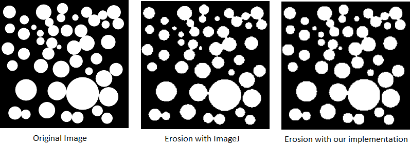

**Figure 1: Result of the erode operation using as a structuring element a cross of 3 by 3 size. Left: Original image, Middle: made with ImageJ default function, Right: made with our own implementation**

As we can see some circles that were stick together have form more disctinct borders. The results obtained between the two process are quite the same. We can see some minor differences from a display view, but the results seems to be the same whatever we use the ImageJ plugin or our own implementation.

For the dilation, we obtained the results below.

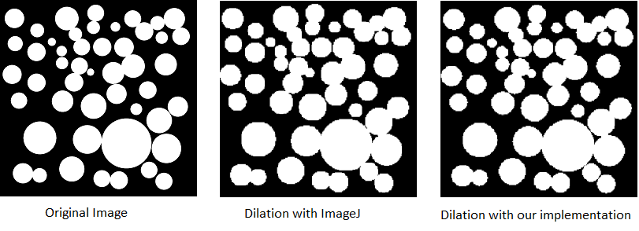

**Figure 2: Result of the dilate operation using as a structuring element a cross of 3 by 3 size. Left: Original image, Middle: made with ImageJ default function, Right: made with our own implementation**

We can observe that the same way as the erode operation, the dilate results obtained for both the Image J function and our own implemenantation have the same general outcome. Even tough we can see at some locations that some circles are more dilated by the ImageJ implementation. However, the general results can be considered as the same.

Now that we have proven that the results obtained by both of our plugins are the same, let's take a look at the benchmark obtained :

The values obtained from the benchmark for our erode operation result in this graph.
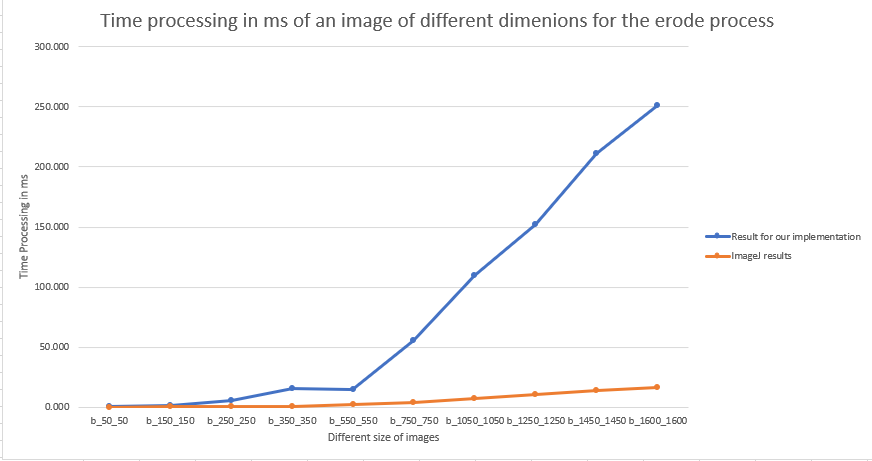

**Figure 3: Benchmark graph representing the time processing in ms of an image of different size for the erode process**

As we can note, until the image of a size of 150\*150 pixels our performance are really close to the ImageJ erosion. From the 250\*250 pixels image to the one at 550\*550 we can observe a difference of a ration of 7. This means that for an image with 550\*500 pixels our implementation will take 7 more times than the ImageJ implementation to erode one image (14.999ms for our implementation against 2.09466ms for the ImageJ one).
However, is we couls be satisfied with our results from a small image until the 550\*550 images, we can't say the same for the rest.
From this size until our biggest size, the results we obtained from our implementation are quite(to not say very) bad. Indeed, where we had a ration difference of 7 for an image of size 550\*550 pixels, for images of bigger size we double this ration to obtain a value of 15. Yet this ratio don't change whatever we use a 750\*750 pixel or a 1600\*1600 pixel image.

The values obtained from the benchmark for our dilation operation result in this graph.
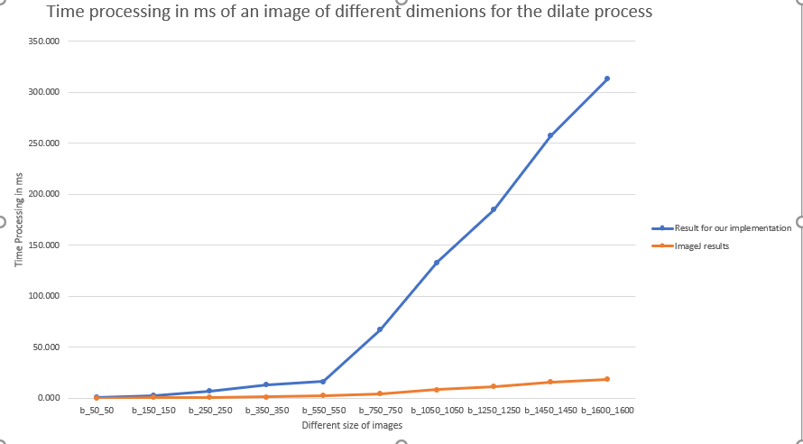

**Figure 4: Benchmark graph representing the time processing in ms of an image of different size for the dilate process**

The observation are quite similar to the the results obtained for the erosion even the ration difference for an image of 550\*500 pixels is the same (ratio of 7). The ration after this critical size if also the same (ratio of 16).

### Open and Close

The same way as we did for the erosion and dilation, the open and close methods have been runing the default functions available in ImageJ. The parameters used are the same as the erode and close operations.

The differents output obtained for the open process are those :

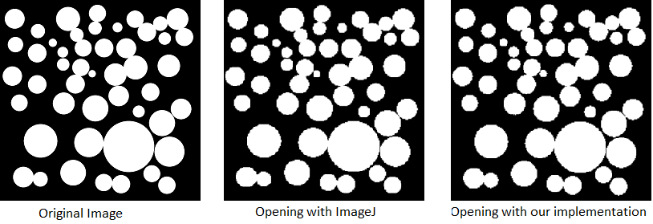

**Figure 5: Result of the open operation using as a structuring element a cross of 3 by 3 size. Left: Original image, Middle: made with ImageJ default function, Right: made with our own implementation**

As we can inspect after the open operation, the circles from the original image are more pixeled in the their border, for both of the implementation, even tough it seems that ImageJ implementation result in more pixeled border than our implementation.

The ouput results for the close operation are those below. 

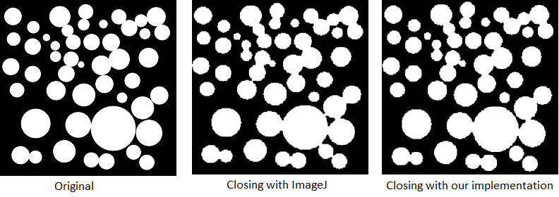

**Figure 6: Result of the close operation using as a structuring element a cross of 3 by 3 size. Left: Original image, Middle: made with ImageJ default function, Right: made with our own implementation**

The results obtained after a close operation are in a general way the same for both of the implementation, resulting in the removal of small holes. However, as we can note, the ImageJ implementation closes gaps between object in a more important radius than our own implementation.

Let's take a look at the benchmark results.

The benchmark for the opening is :

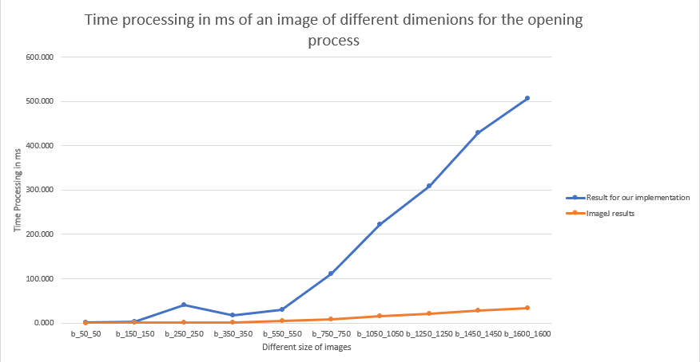

**Figure 7: Benchmark graph representing the time processing in ms of an image of different size for the opening process**

Since closing and opening, are the erosion of the dilation and vice verse, the issue encountered for the erode and dilate operation will be present here too.
Indeed, as we can see the observation are quite similar to the the results obtained for the erosion/dilation even the ration difference for an image of 550\*500 pixels is the same (ratio of 7). The ratio after this critical size if also the same (ratio of 15-16).

The associated benchmark of the close operation is as follows.
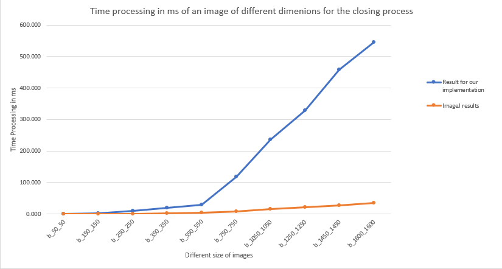

**Figure 8: Benchmark graph representing the time processing in ms of an image of different size for the closing process**

The observation we can do for the closing operation are exactly the same as the opening one, and so the same as the erode/dilate.
We can see the observation are similar to the the results obtained for the erosion/dilation even the ration difference for an image of 550\*500 pixels is the same (ratio of 7). The ratio after this critical size if also the same (ratio of 15-16).

### Hit or Miss
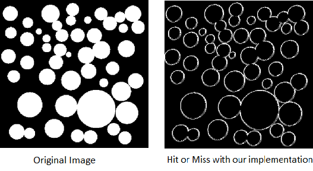

**Figure 9: Result of the hit or miss operation using as a structuring element a cross of 3 by 3 size. Left: Original image, Middle: made with ImageJ default function, Right: made with our own implementation**

### Skeletonize
The skeletonize method have been done running the default functions available in ImageJ.

The images output from the watershed process are those below.

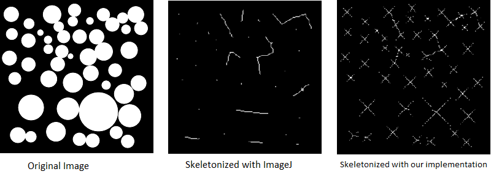

**Figure 10: Result of the skeletonize operation using as a structuring element a cross of 3 by 3 size. Left: Original image, Middle: made with ImageJ default function, Right: made with our own implementation**

As we can see, the output result if different from the ImageJ results and our own implementation. In Image J we obtain only the ultimate eroded point for the circles which don't touch and a line from the center of a circle to the center of the second circle when those are stick together. Yet, in our implementation we can see the diagonals for each of the ultimate eroded point. The lines formed in ImageJ when two circles are stick are also shown.

Let's see our benchmark results.

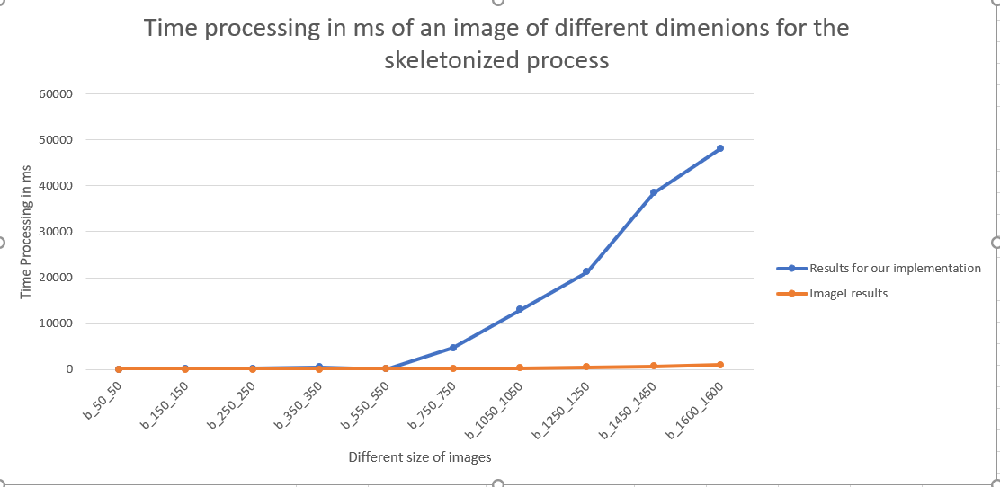

**Figure 11: Benchmark graph representing the time processing in ms of an image of different size for the skeletonize process**

Once more the pattern shown is quite the same. Until the 750\*750 image pixels our implementation is stable with a ratio difference of more or less 30. But from this size to the highest posible, our ratio difference goes from 30 to 50.

### Watershed

The wathershed method have been done running the default functions available in ImageJ.

The images output from the watershed process are those those one below.
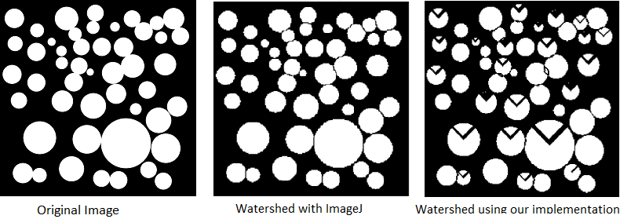

**Figure 12: Result of the wathershed operation using as a structuring element a cross of 3 by 3 size. Left: Original image, Middle: made with ImageJ default function, Right: made with our own implementation**

We can obeserve than there is the presence of an element that is not present in the ImageJ implementation : the appearence of black triangles within some circles. This is due to a bug in our implementation and how the plateau are treated(see, chapter 2-watershed for more details).  Appart from this, the circles are well delimited the same way as ImageJ.

As we can see some circles that were stick together have form more disctinct borders. The results obtained between the two process are quite the same. We can see some minor differences from a display view, but the results seems to be the same whatever we use the ImageJ plugin or our own implementation.

The benchmark associated to the watershed operation is the following one.
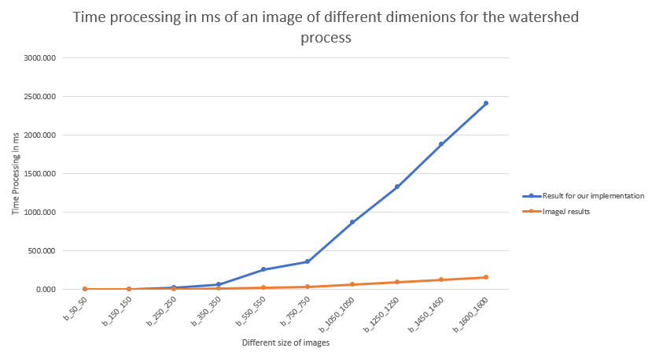

**Figure 13: Benchmark graph representing the time processing in ms of an image of different size for the wathershed process**

We can see that the pattern present in the erode/dilate part is also noticable here. For smal image of 50\*50 pixels until 350\*350 pixels the performances are quite similar to those obtained with ImageJ.
From 350\*350 image pixels to the biggest one there is a ratio difference betwen our implementation and the ImageJ implementation between 13 and 17(even tough it would seems from the graph that for a 1250\*1250 image pixels the ration is higher in reality it's not)

## Discussion

[//]: # (Discussion: Comparison of your implementation with those of ImageJ. Is it faster, better, less memory consuming, ...?)

In this part we will discuss about the implementation of our own implementation and it's state against the ImageJ implementation.

Sadly, as explained ealier, we were not able to determine the memory usage of our implementation using the Firefox console, even tough we can assume that we will be way less optimized than ImageJ.

For the erode, dilate, open and close operations, we were able to find the same output as the ImageJ Implementation. However, as the result aprt has shownd, our performance are for every dimenstion of image worse than ImageJ. For the smallest image we are able to only have a ratio difference of 2 between our implementation and the ImageJ one, but when we look for the largest one we go as high as a ratio of 15.
At best, we are 2 times slowers than ImageJ and at worst we are 15 slover with our implementation.
Moreover, our implementatio of those function are also different, since ImageJ use predefined structuring elements whereas our implementation of those operations let the user to be free to use any kernel he wish from a 3\*3 to something like for example a 45\*45 kernel.
The erode and dilate function could be optmized since right now, for each pixels values it will recalculate the kernel pattern(all the neighbours) while that kernek doesn't change during the processing time, and so it uses pointless time processing.

The hit or miss operator, was a tricky one to do. Indeed, compared to all the others, we had no ImageJ equivalent to compare the obtain results. In an indeal world, the hit or miss function shjould be test with a kernel with a high size to see the output.

The skeletonize implementation was not as good as we excpected. As said in the result part, we don't have the exact same image as ImageJ. This due do some issues we encountered.
Our function, delete some point that it should not, and don't delete some point he should. This may come from the fact that our function, only check as neighbours 4 of them and not all of the 8 neihgbours.
Moreover, we use a naive approach, in the sense that we delete every pixel that is in contact with an interior pixel whereas sometimes you should not, however this would require conditions we were not able to determine
An amelioration of the operations will require to fixes thos bugs, to obtains the exact same image as imageJ.

Finaly, the watershed implementation has result in the same kind of problem we encountered with skeletonize. The output image from our implementation is different from the ImageJ implementation. This is due to the translation of an algorithm into code that we were not able to resolve completly (the pleateau issue, check material et methode-watershed).
As for skeletonized, and amelioration would be to fix this bug issues, so that our image output would be the same as the ImageJ one especially that a part from that plateau bug, our circles are well defined.

## Conclusion

Our task was to implement the morphological operators erode, dilate, open, close, hit or miss, skeletonize and watershed using javascript, and as much as functional Javascript as we could.
As result, we managed to make most of our operation similar to ImageJ at least from a layout perspective. Unfortunately, even tought our implementation may have acceptable time processing values for low size images, the ratio difference bewteen our implementation and ImageJ implemenation is way to high to be considered as satisfasing. 
This end correspond to the expected end, in the sense that we could have not do better performing time than an ImageJ wich is a software used by the a large communities with many contributors.
However, the next step will be the adding of webgl tools in our implementation, so we may have way more better results and we could hope to have time processing results more satisfacting against ImageJ than those actuals. 

## References

[//]: # (References. To complete if required. Be sure that all of your references are called in the text.)
[^JAN2006] : http://internationalmathematicasymposium.org/IMS2006/IMS2006_CD/articles/Jankowski.pdf

http://internationalmathematicasymposium.org/IMS2006/IMS2006_CD/articles/Jankowski.pdf
