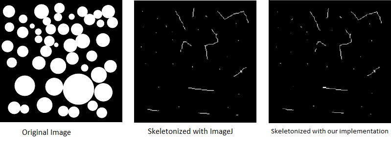
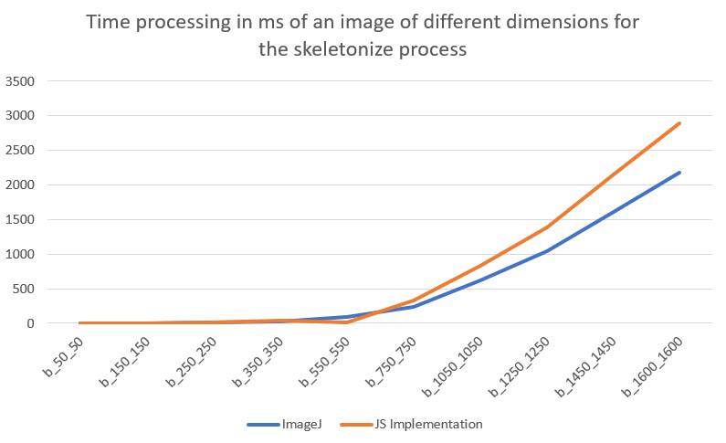

# Tiny Image in JavaScript : Mathematical Morphology

Rodolphe TWOREK

Link to Github : https://github.com/ReiNoIkari/Morphological-Image-Processing

## Introduction

Nowadays, scientists have access to huge image databases which can make studying organisms easier. One problem still persist : those collected datas are worthless if they are not interpreted and the concern is that a lifetime won't be enough for a scientist to follow the flow. That’s were informatics come in order to help to analyse those huge amount of raw data, and in our case more precisely Image Processing. Indeed, the developement of some Image processing tool made that easier to computerize and 
analyse.

Mathematical morphology has been invented in 1964 by Georges Matheron and Jean Serra in the MINES ParisTech's laboratories. Its development was always motivated by industrial application. At the begining, the main purpose was to answer issues in the mining exploitation field. Then this purpose diversified itself to biology, medical imagery, material science, industrial vision, multimedia, teledetection, geophisic, etc. It consist in a mathematical and informatical theory and technique which is linked with algebra, the lattice theory, topology and probabilities.

Currently, one of the mathematical morphology’s main field is Image Processing. It particularly allows to use filtering, segmentation and quantification tools. Since it’s emergence in 1964, it knows a growing success and constitutes a part of many Image Processing softwares yet.

For the purposes of object identification required in industrial vision applications, the operations of mathematical morphology are more useful than the convolution operations employed in signal processing because the morphological operators relate directly to shape.

For this third step corresponding to the Javascript implementation, we had to make our own implementation of the skeletonize operation from the available code from ImageJ and coded in Java to a Javascript version.

This report will contain the translation of the skeletonize operation found in ImageJ from Java to Javascript. We will focus on describe in detail the skeletonize operation in the Material & Methods part. We will then present our results with the use of the same input image sample, followed by a comparison about our implementation, the ImageJ processes and the WebGL version. Finally, we will discuss about our work and some possible improvements.

It has to be noted that, the results, the discussion and the conclusion parts will be similar between the two person's report working on the skeleton operations, since those parts were made by the two person and we tough that since thoses parts are linked, it would be more pleasant to share the common parts.

## Material & Methods

In order to convert the Java code in JavaScript, we had to obtain the code available in their github. 

From the ImageJ code, we had then to take off every aspect of the code that was related to the ImageJ layout, in order to just keep the core code whose was part of the skeletons process. 

The skeletonise function from ImageJ is built using a main function, that calls all secondary functions used to process the different steps. 

Another thing to note is that the thinning function use intermediates value of 1,2 and 3, values available in the code table that we will explain below.

### Skeletonization

The skeletonization is a part of the morphological operators that will transform the different shapes from image in a thinner version equidistant to their boundaries. It is mainly use in optical character recognition and fingerprint recognition. Skeletons have several different mathematical definitions in the technical literature, and there are many different algorithms for computing them. For our project we had to implement the algorithm used by ImageJ from Java to JavaScript. Refering to the user guide [^OCT2012] of ImageJ 1.46r and the avaible source code, we were able to determine that ImageJ implements a thinning algorithm from Zhang and Sue[^MARS2016].

This algorithm could be summed up in two main steps. The first one consists in marking the right foreground pixels to be removed. In order to be eligible, each pixel needs to successfully pass five conditions that are as follow:

    1 - The pixel is white and has eight neighbours
    2 - 2 <= B(i,j) <= 6 
    3 - A(i,j) = 1
    4 - At least one of P2 and P4 and P6 is black
    5 - At least one of P4 and P6 and P8 is black

for the first condition : the processed pixel needs to be a foreground pixel and to have eight neighbours (this will prevent some error with border pixels).

The second condition is related to how the neighbours pixels will be processed.
Here are all the neighbours of a P1 pixel:

    P9 P2 P3 
    P8 P1 P4 
    p7 P6 P5 

At this step, we calculate B(P1) which is the number of neighbours of P1 which have background pixel value.

The third step is to determine the number of transitions from foreground pixel(255) to background pixel(0). Using the example above, the clockwise sequence is P2,P3,P4,P5,P6,P7,P8,P9,P2. (Note the extra P2 at the end, it is circular). The number of transition must be between two and six included.

The fourth step and the fifth are very similar (only the neighbours change). At some fixed positions, the pixels in P2, P4 ans P6 must be foreground pixel, for the fifth step, it's the pixels in P4, P6 and P8.

Once all the five steps are passed, then the algorithm can process to step 2, which is the follow :

    1 - The pixel is white and has eight neighbours
    2 - 2 <= B ( P 1 ) <= 6
    3 - A(P1) = 1
    4 - At least one of P2 and P4 and P8 is black
    5 - At least one of P2 and P6 and P8 is black
 
As we can note, the steps are very similar. Actually, there is only two differences between pass one and pass two, with the position that are checked in steps four and steps five.

The image is then correlated with a mask that assigns each pixel a number in the range of 0 to 255, corresponding to each possible pattern of its 8 neighbouring pixels. A lookup table is then used to assign the pixels a value of 0, 1, 2 or 3, which are selectively removed during the iterations.

Finally, if all the steps are checked, then the processed pixels P1 is set to a background pixel (black).

In order to do this skeletonize function, we converted the functions used in ImageJ.

The skeletonize function is composed of multiple functions. 

The function `skeletonize` can be considered as our main. It takes as input and image, and returns one, calling a secondary function `skeletonize_process` which takes as input a raster, and returns a raster.

`skeletonize_process()`, will then call another function, `thin()` in order to do the thinning process(we will talk about it below), and will make sure that every pixels marked to be removed will indeed be removed.

To describe the function `thin()`, let's start with the parameters, it takes as input a raster, a table (the table described above) and a pass (a number telling if it is an even or odd pass). It iterates through the whole list of pixels of an image, and for each pixel that is a foreground pixel, it will check if the pixel is at the border of an image using the function `is_border()`. If it's not, then it means that the pixel has eight neighbours, and so the process can continue.

It will then, get all the neighbours value of the proceeds pixels,and set a score considering the neighbours values.

Using the scores obtained previously, the function will check the value of the pixel from the defined table, using the score as an index. Depending on if it is an even or odd pass, the conditions are different, but the ending point is the same, which is to determine if the pixel beeing processed must be removed or not.

## Results & Discussion

Now that we have explained our implementation, we will compare the results obtained for each of our process using the implementation of ImageJ and our implementation in JavaScript. The same image will be used for every process, the input image will always be a binary image and we will use a 3x3 cross kernel, which corresponds to the one used by ImageJ. 

Our benchmarks for the imageJ process were done using a custom plugin created by ourselves. Our implementation’s benchmark are also done using a custom script. The function `Performance.now()`(or `startBenchmark()` for the ImageJ plugin) gives us the time of executions in ms (and ImageJ in ns). Both of our script first comports a preheating phase, running over 100 images in order to initialise the classes. We were not able to calculate the memory usage using firefox methods, so we won't be able to talk about it.

The skeletonize method have been done running the default functions available in ImageJ.

The images output from the skeletonize process are shown below.

**Figure 1: Result of the skeletonize operation using 3 by 3 kernel. Left: Original image, Middle: made with ImageJ default function, Right: made with the JavaScript version of ImageJ's function**

As we can see, the output results are quite identical between the 
between the ImageJ’s results and our JavaScript implementation of the ImageJ code.  

With the skeletonization, we obtain the ultimate eroded point when the circles don't touch and a line corresponding to the link from the center of a circle to the center of the second circle when those are touching.

Let's see our benchmark results.

**Figure 2: Benchmark graph representing the time processing in ms of an image of different sizes for the skeletonize process**

Our results are close to similar to ImageJ.
As we can see, our execution times are really close to ImagesJ's skeletonization's ones until the 750\*750 image. At 1600\*1600 our javascript is 25% slower than the Java implementation (2175ms for Java, 2886ms for JavaScript) to skeletonize one image. 

Moreover, the results obtained are quite satifying. The mean ratio between our Implementation and ImageJ's is 1.40. This can be because of the JavaScript language and the use of a browser, since the Javascript code is just an adaptation of the ImageJ Java code.

## Conclusion

Our task was to implement the skeletonize morphological operators using the Java version of ImageJ in JavaScript. 

As results, we managed to make our skeleton operation similar to ImageJ. Unfortunately, we can see that the bigger the image is, the bigger is the gap between ImageJ and our implementation. 

This end corresponds to what we expected, in the sense that, we could have not done better performing time than an ImageJ, which is a software used by the a large community with many contributors, and the fact that we were bound to JavaScript.

## References

[^OCT2012]: https://imagej.nih.gov/ij/docs/guide/user-guide.pdf
[^MARS2016]: http://www.iosrjournals.org/iosr-jce/papers/Vol18-issue2/Version-5/H1802054851.pdf