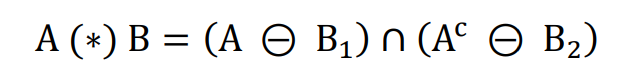
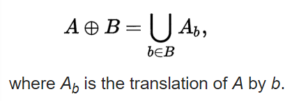
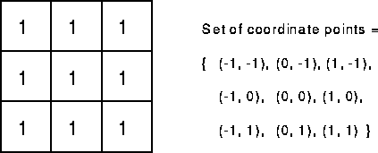
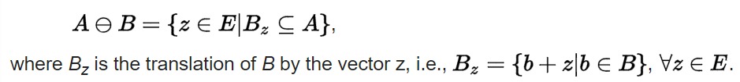
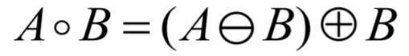
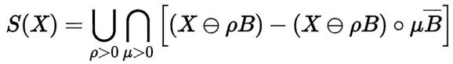
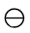
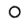
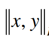
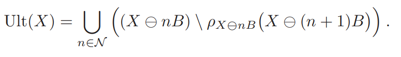

# Tiny Image in JavaScript : Mathematical Morphology

Vincent DEJONGHE, Adrien MENDES SANTOS, Rodolphe TWOREK\*

Link to Github : https://github.com/ReiNoIkari/Morphological-Image-Processing

## Introduction

Nowadays, scientists have access to huge image databases which can make studying organisms easier.  One problem still persist : those collected datas are worthless if they are not interpreted and the concern is that a lifetime won't be enough for a scientist to follow the flow. That’s were informatics come in order to help to analyse those huge amount of raw data, and in our case more precisely Image Processing. Indeed, the developement of some Image processing tool made that easier to computerize and analyse [^GON1992][^JAI1989].

Mathematical morphology has been invented in 1964 by Georges Matheron and Jean Serra in the MINES ParisTech's laboratories. Its development was always motivated by industrial application. At the begining, the main purpose was to answer issues in the mining exploitation field. Then this purpose diversified itself to biology, medical imagery, material science, industrial vision, multimedia, teledetection, geophisic, etc. It consist in a mathematical and informatical theory and technique which is linked with algebra, the lattice theory, topology and probabilities[^SCH1993].

Currently, one of the mathematical morphology’s main field is Image Processing. It particularly allows to use filtering, segmentation and quantification tools. Since it’s emergence in 1964, it knows a growing success and constitues a part of many Image Processing softwares yet.

For the purposes of object identification required in industrial vision applications, the operations of mathematical morphology are more useful than the convolution operations employed in signal processing because the morphological operators relate directly to shape.

In this project, we will focus on the Morphology part from Image Processing, we will initially explain some main operations in this area, then observe obtained results from those operation applied on an image, to finally discuss about them.

## Material & Methods

ImageJ is a mutiplatform open source software for image processing developped by the National Institutes of Health. It was originaly developped for biomedical uses. It allows for example to analyze electrophoresis gels, or the the tumor detection and analysis. It uses since broad to other fields. Thus, a huge amount of current operations are yet doable with the software : greyscale adjustment, noise reduction, lightning correction, boundaries detection, Fourier transform, thresholding, logical and arithmetical operation between images and linear transform. Processes taken from mathematical morphology are also available such as erosion, dilatation, watersheld, skeletonize, etc. During this project, we will focus on the latter functions. Besides, ImageJ allows the user to add new functionnalities by implementing plugins and macros, which we will be used to compare to the default ImageJ's functions.
 

The main purpose of mathematical morphology is to study or process a set with an other set called structuring element or kernel, wich is used as a probe. For each position of this structing element, a look is taken about its ability to touch or be inclued on the main set. The result of this process is an output set.
This involves a loss of information, but also a great elimination of structures that do not fits to certains criteria such as width or volume.

In order to be able to compare and discuss about the different algorithms in a practical and effective way we decided to create a benchmark.

It could be described this way:

Firstly, we initialise our classes during a warm up phase so ImageJ don't loses time during the critical phase.
Then we launch 10,000 (10x1000) times our functions in order to statistically analyse them and being sure to limit variance within the data.
In order to compare the relevance of the structuring element, we decided to run our different operation with a completely different kernel than the one used by default in ImageJ. This kernel is shaped as a 45 degrees diagonal in a 3 by 3 pixel square.

### Hit-or-Miss
Hit or miss is what could be defined as the basic operation of the morphological area of image processing. It is used to detect occurrences given binary patterns in fixed orientations. It can be used to look for several patterns (or alternatively, for the same pattern in several orientations) simply by running successive transforms using different structuring elements, and then running OR operation between all the results. Therefore, Most of the other morphological operations are derived from this notion(opening, closing, erosion, dilation...)[^ELR2014].
If any "on" pixels of the image to process' targeted area is covered by "on" pixel of the structuring element, it is called "hit".
If none of the image that have to be processed' "on" pixel in a targeted area is covered by a "on" pixel or the structuring element, it is called "miss". 
If all "on" pixels on structuring element is cover all "on" pixels of an image to process targeted area, it is called "fit".
In general, the hit or miss transform is defined as :

**Equation 1 : Hit or Miss Formula**

With the condition that B1 ∩ B2 = Ø, because if B1 is not a negative mask of B2, the hit-miss transform would result in the empty set. 

**Figure 1 : Hit or Miss principle**

### Dilate & Erode 

The dilation operator takes two pieces of data as input. The first one is the image which is going to be dilated and the second one is the structuring element. Thus, the structuring element determines the precise effect of the dilation on the first image [^HAR1992][^GIL2002].

It mathematically goes like this :

In one hand, X is the set of Euclidean coordinates which corresponds to the image that has to be dilated. In an other hand, S is the set of Euclidean coordinates for the structuring element. o cooresponds to the origin of S and the translation of the structuring element upon the image that have to be processed is called So. The the dilatation of X by S then correspond to the set of corresponding points between o and X. In an other way, it corresponds to the set of all points o such that the intersection of So with X is non-empty.

**Equation 2 : Dilatation Formula**

Let's take a 3x3 square structuring element as an example for binary dilation, with the origin at its center, as shown in Figure 1. Note that in this and subsequent diagrams, foreground pixels are represented by 1's and background pixels by 0's.

**Figure 2 : A 3×3 square structuring element**

To compute the dilation of a binary input image by this structuring element, we consider each of the background's pixels in the input image that has to be processed. For each of those, the structuring element is superimposed upon the input image so that the origin of the structuring element matches with image to be processed's pixel position. If at least one pixel in the structuring element matches with a foreground pixel in the image underneath, then the input pixel is set to the foreground value. If all the corresponding pixels in the image are background, however, the input pixel is left at the background value.

For our example 3×3 structuring element, the effect of this operation is to set to the foreground color any background pixels that have a neighboring foreground pixel. Such pixels must lie at the edges of white regions, and so the practical upshot is that foreground regions grow (and holes inside a region shrink).

**Figure 3 : Result of the Dilate operation using as a structuring element a disk of 3 by 3 size. This operation is done 2 times in a row**

The erosion operator is the dilatiation operator's dual[^GON1992]. Indeed, each of the foreground pixels in the input image in turn are considered. For each foreground pixel we superimpose the structuring element on top of the input image so that the origin of the structuring element coincides with the input pixel coordinates. If for every pixel in the structuring element, the corresponding pixel in the image underneath is a foreground pixel, then the input pixel is left as it is. If any of the corresponding pixels in the image are background, however, the input pixel is also set to background value. 

**Equation 3 : Erosion Formula**

For our example 3×3 structuring element, the effect of this operation is to remove any foreground pixel that is not completely surrounded by other white pixels (assuming 8-connectedness). Such pixels must lie at the edges of white regions, and so the practical upshot is that foreground regions shrink (and holes inside a region grow). 

**Figure 4 : Result of the Erode operation using as a structuring element a disk of 3 by 3 size. This operation is done 2 times in a row**

### Opening and Closing

Opening and closing are two secondary operations that play an important role in morphological image processing. Both could be defined as the combination of erosions and dilations and since they are derived from eroding and dilate they posses the same limits as the original techniques which means they can only be applied to binary images (or a graylevel image in particular cases). The general aims of those two operations are quite simple: making an image as smooth as possible without size change (or at least limited).
Let's take a closer look to the opening operation[^BRO2015][^GIL2002].

The opening technique consist of an erosion followed by a dilation using the same structuring element for both operations

**Equation 4: Mathematical definition of the opening morphological transformation** 

In a simple way opening will have for effect to opens black holes inside white regions and separates touching white regions (in the case that the objects are bright on a dark foreground).It will have as effect the removal of capes, isthmus and islands smaller than the structuring element.
Here is a pratical application :

**Figure 5: Result of the Opening operation using as a structuring element a disk of 3 by 3 size**

As we can see in fig. 11 some black areas that were inside white figures have been connected with the outside due to some foreground pixel removal.
Here is an explanation : the erosion is done first, which is shrinking the boundaries of your objects. After that we perform dilation, which is expanding the boundaries of the objects. Thus, because small ones were removed in erosion step, bring back biggest elementsare brought back.

Closing is the dual of opening and can be described mathemacaly with :

**Equation 5: Mathematical definition of the closing morphological transformation** 

This could be described like this : closing is a dilation followed by an erosion using the same structuring element for both operations
Closing is similar in some ways to dilation in that it tends to enlarge the boundaries foreground (bright) regions in an image (and shrink background color holes in such regions).

Let's use once more a pratical application : 

**Figure 6: Result of the Closing operation using as a structuring element a disk of 3 by 3 size**

We can observe that closing have the opposite effect of opening : instead of opening the black areas inside our white figures, closing closes them which have for effect to make them disappear.
It is important to note that opening and closing are less destructive of the original boundary shape than erode and dilate.

### Skeletonize

Skeletonization (also called "Medial Axis Transform" or MAT) allows the user to reduce a focused region from a binary image to its skeletal remnant. Indeed, most of the foreground pixels are throwed when the connectivity is concerved [^LEG2016]. 
This process is mostly compared as an explanation to a slow-burning material. Fire is set simultaneously to all the boundary of the area of interest. This fire slowly moves into the interior of the area. A trace remains at each point when the fire coming from each area meets itself. This trace is called "quench line" and represents the skeleton of the area.
The skeleton/MAT can be produced in two main ways using the erode operator or the distance transform. The first successively erodes away pixels from the boundary (while preserving the end points of line segments) until no more thinning is possible whereas the second calculates the distance transform of the image. The skeleton then lies along the singularities in the distance transform. The latter approach seems to be more adapted to the MAT calculation. Indeed, the MAT is the same as the distance transform but with all points off the skeleton suppressed to zero[^VER1991].
 Whether differents skeletonization algorithm exist, the general effects are all similar, as are the uses to which the skeletons are put.

Mathematically, skeletonize is reprensented by :

**Equation 6 : skeletonyze Formula**

Where  and  are the morphological erosion and opening.

The skeleton aims to provide a simple representation of a shape that preserves many of the topological and size characteristics of the original. Thus, for instance, we can get a rough idea of the length of a shape by considering just the end points of the skeleton and finding the maximally separated pair of end points on the skeleton. Similarly, we can distinguish many qualitatively different shapes from one another on the basis of how many 'triple points' there are, i.e. points where at least three branches of the skeleton meet.

In addition, to this, the MAT  has the property that it can be used to exactly reconstruct the original shape if necessary.

As with thinning, slight irregularities in a boundary may interfere with recognition processes based on the topological properties of the skeleton. 

**Figure 7: Result of the skeletonize transform using as a structuring element a disk of 3 by 3 size**

### Euclidean Distance Mapping
The Euclidean Distance Mapping (or EDM), is one of several Distance transform techniques in Image Processing. The shortest distance to the nearest pixel in the background for each objects is labeled. The result looks pretty similar to the original inputed image in terms of shape, but the pixel's greyscale values are changed to show the distance to the closest boundary from each point.
Once again, the metaphor of a fire cunsumming a slow burning material is often used to describe the process. Just as the skeletonize tranform, a fire starts at each point of the object's boundaries and moves into the interior. Each point in the interiour is labeled with the amount of time that the fire took to reach it [^BAI2004].  

Several kind of distance transform exists, depending upon which distance metric is being used to determine the distance between pixels. The 'chessboard distance' and the 'city block' transform can be quoted, using respectively 3×3 square and cross shaped structuring elements whereas the Euclidean distance mapping uses a disk shaped one.
From a measurement perspective, the Euclidean distance is the most useful because it corresponds to the way objects are measured in the real world.

**Equation 7 : EDM formula**

Where , is some two-dimensional distance metric. Different distance metrics result in different distance transformations. The Euclidean distance metric uses the L2 norm.
This metric is isotropic in that distances measured are independent of object orientation, subject of course to the limitation that the object boundary is digital, and therefore in discrete locations. The major limitation of the Euclidean metric, however is that it is not easy to calculate efficiently for complex shapes. 

**Figure 8: Result of the Euclidean distance mapping using as a structuring element a disk of 3 by 3 size**

### Ultimate eroded point

Ultimate eroded point (or UEP) is derived from the EDM operator and could be defined as the last point that would be present after recursively eroding until the last pass before the object would be invisible[^LEG2016]. 
In order to apply multiple UEP on an image, each object thus could be considered separately, which makes possible to use different numbers of erosions for each object and so having the ultimate eroded point not only for an image but for each object which is useful for cells images for example. 

The ultimate erode point is represented as follow :

**Equation 7 : UEP formula**
In an image, for each object, the algorithm will find the brightest pixel and ensure that none of the other pixels are as bright. If it is the sole point, then it will be the only one to be part of the UEP, if there are multiple pixels of the same object, then the center of the brightest pixels will be used. Furthermore, in order to be categorized as a UEP, the determined pixel besides being the brightest need to be a point that is equidistant from at least two (but usually three) boundary locations. In order to find the brightest point, the UEP method uses the peaks or local maxima of the EDM.
Usualy,The Ultimate eroded point operation is used as a marker for objects locations

**Figure 9: Result of the ultimate erode point using as a structuring element a disk of 3 by 3 size**

## Results

This section is dedicated to the results obtained using the default operations in ImageJ and if there are available some third party plugins. The image used is one of the sample available by default in ImageJ, called "Embryos". The input image will always be in binary mode.

### Erode and Dilate

The erosion and dilates methods have been runing the default functions available in ImageJ and plugins created by the Institut Jean-Pierre Bourgin - INRA(MorphoLibJ). The original file have to be be a binary image, and the process' result will be of the same type. We encountered a problem by searching how to select a specific structuring element pattern in ImageJ. Indeed, if the option exists, we didn't find it, the default one being a disk of size 3 whereas the MorphoLibJ plugin allows the user to choose between disks, diamonds, lines...

**Figure 10: Result of the erode operation using as a structuring element a disk of 3 by 3 size. Left up: Original image, Right up: made with ImageJ default function, Left down: made with MorphoLibJ plugin, Right down: made with our diagonal kernel**

As we can see some black areas that were inside white figures have been connected with the outside due to some foreground pixel removal. This is due to the fact that some foreground pixel have been removed (due to not being surrounded by other foreground pixels). Moreover, the results seems to be the same whatever we use one plugin or the other.

The same results have been obtained by the dilation operation as we can see :

A common observation when using an other kernel is that we can observe some slight differences in the ouput image. Indeed, some background pixels are more or less present depending on where we look compared to the other images using the default kernel.

**Figure 11: Result of the dilation operation using as a structuring element a disk of 3 by 3 size. Left up: Original image, Right up: made with ImageJ default function, Left down: made with MorphoLibJ plugin, Right down: made with our diagonal kernel**

This time, it's background pixels that are removed in favour of foreground pixels.

A benchmark was done in order to compare the excution time and the usage of memory for both plugins which are below :

**Figure 12: Benchmarks of the erosion and dilation operation using as a structuring element a disk of 3 by 3 pixels size. Left : Results of the ImageJ plugin  right : Results of the MorphoLibJ plugin**

As we can see the average excution time from 10000 runs as the average memory used for the default ImageJ plugin are less than the MorphoLibJ plugin for both of the operations. For ImageJ we have an average excution time of 13.683 ms and average memory used of 52.066 MiB while for the MorphoLibJ we have an average excution time of 55.496 ms and average memory used of 57.509 MiB

### Open and Close

The opening and closing operation take as input a binary image and conserve the same type as output.
As for the erosion and dilation method, we used the same protocol using ImageJ default function and the plugin created by the INRA.
The result obtains for the opening are as follow :

**Figure 13: Result of the opening operation using as a structuring element a disk of 3 by 3 size. Left up: Original image, Right up: made with ImageJ default function, Left down: made with MorphoLibJ plugin, Right down: made with our diagonal kernel**

As a reminder, an opening operator could be resumed as an erode followed by a dilation. As a consequence, we should see some traces of it.
By having a closer look, we can see that indeed an erosion has been applied to the picture, but that compared to the fig.12 the black areas are little less more present. We can explain this as the fact that compared to the figure 10, just after the initial erosion, the dilation will have for effect to expand the boundaries of the objects. Thus, because small ones were removed in erosion step, biggest elements are brought back.

The results obtained from the closing operation are the follow :

**Figure 14: Result of the closing operation using as a structuring element a disk of 3 by 3 size. Left up: Original image, Right up: made with ImageJ default function, Left down: made with MorphoLibJ plugin, Right down: made with our diagonal kernel**

We can observe that closing have the opposite effect of opening : instead of opening the black areas inside our white figures, closing closes them which have for effect to make them disappear.

As for the erode and dilation operations, the use of an other kernel have an inpact on the output image.

It is important to note that opening and closing are less destructive of the original boundary shape than erode and dilate.

Here are the benchmark's results for the open and close methods :

**Figure 15: Benchmarks of the open and close operations using as a structuring element a disk of 3 by 3 size. Left : Results of the ImageJ plugin  right : Results of the MorphoLibJ plugin**

As we can see the average excution time from 10000 runs as the average memory used for the default ImageJ plugin are less than the MorphoLibJ plugin for both of the operations. For the opening operation, for ImageJ we have an average excution time of 29.928 ms and average memory used of 52.618 MiB while for the MorphoLibJ we have an average excution time of 51.086 ms and average memory used of 102.283 MiB. For the closing operation, for ImageJ we have an average excution time of 29.941 ms and average memory used of 52.619 MiB while for the MorphoLibJ we have an average excution time of 51.671 ms and average memory used of 101.562 MiB

### Skeletonize

The Skeletonize operator is used in order to only have left a skeleton (from the boundary of an object). It takes as input a binary image, and as output a binary too.
Only the default ImageJ default function was used as we didn't find any ready to use plugin that we thought pertinent.

The skeletonize operation give an image as follows :

**Figure 16: Result of the skeletonize operation using as a structuring element a disk of 3 by 3 size. Left : Original image, right : made with ImageJ default function**

Cells that only contains foreground pixels only leave a little trace as a skeleton compared to the other cells. 
The second thing to point out is that the more background pixels an object contains the more detailed (and complex) a skeleton can be.
In a complex environment like a biological culture, the skeletonize operation alone cannot be enough to have an idea of the shape.

Even tough the lack of plugins won't let us compare some performances we still decided to perform benchmarks results for the ImageJ plugin. The results are the one given below :

**Figure 17: Benchmarks of the skeletonize operation using as a structuring element a disk of 3 by 3 size.**

As we can see, for the  for the skeletonization  operator we have an average excution time of 104.127 ms and average memory used of 86.735 MiB.

### Euclidean distance map

Euclidean distance map (or EDM) is a method which consist in calculating the distance between a foreground pixel and the closest background neighbor pixel.
The image obtained is as follow :

**Figure 18: Result of the EDM operation using as a structuring element a disk of 3 by 3 size. Left : Original image, middle : made with ImageJ default function, right : made with MorphoLibJ plugin**

As we can see, we have two main results. The objects containing no (or not many) background pixels inside in the original picture, have a better score. The furthest from any background pixel the brighter the pixel, and the higher the score.
The others object, containg many background pixels have lower scores. This is due to the fact that the background pixels in the middle of the object reduce the distances between foreground and background pixels.

Here are the benchmark's results for the skeletonize method :

**Figure 19: Benchmarks of the EDM operation using as a structuring element a disk of 3 by 3 size.**

As we can see, for the  for the EDM operator we have an average excution time of 155.589 ms and average memory used of 85.411 MiB.

### Ultimate eroded point

The Ultimate eroded point is based on the EDM method. The input is a binary image, but the output will be a graylevel image.
It will only keep the pixels with the highest scores on the Euclidean Distance Map (the brightest ones) for each object.
 Here are the results obtained with this method :

**Figure 20: Result of the UEP operation using as a structuring element a disk of 3 by 3 size. From left top to right bottom: original image, the UEP original image wihout process, the UEP original transformed to binary, the transformed UEP with a dilation applied**

After an UEP using the default ImageJ function the output image seems to be only black. In order to check this theory, we transformed the image to binary, and we could already see some points corresponding to the last point that would be eroded for each object. Finally, in order to make the result more usable, we applied a dilation.
As we can, see the more "perfect" the object is, in our case a cell containing only foreground pixels, the more the theoretical ultimate eroded point is valid. However, as soon as we start getting more complex object, we can see that those objects can have multiples ultimate eroded point. This can be explained as the computer is not capable to determine the object in his whole (cause of the background pixels inside the cells) and so is treats which should be considered as one object in multiples, which explain those multiple UEP.

Like the skeletonize operator, and the EDM method we still decided to run some benchmarks for the Ultimate eroded point method. The resultat are has follow :

**Figure 21: Benchmarks of the UEP using as a structuring element a disk of 3 by 3 size.**

We can observe for the UEP method that we have an average excution time of 75.359 ms and average memory used of 195.887 MiB.

## Discussion 

Let's analyse the images we obtained during the result phase. As we can see, using the same structuring element has no significative effect, but using a completely different structuring element modifies the output results. It can be  explained by the fact that the other plugin we used is based on the origial ImageJ functions(the mathematical algorithm being the same for all the erosions for example). But the plugin has been created in order to add more parameters like the structural element choice (INRA plugins).
Therefore, the output image obtained by the "45 degree line", which correspond to the diagonal of the kernel, doesn't completly change but we can easily see the differences compared to the default discrete 3x3 disk.

This proves that the result obtained during Mathematical Morphology depends on the Kernel choice and not on the plugin since the method used is the same.

Let's continue with the benchmarks results.
Between the original ImageJ function and the plugin created by the INRA, there is quite a difference as it can be observed. 
At first, the ImageJ's function tends to use less memory and to run faster than the INRA plugin. Indeed, ImageJ's erode operator would take about 13.68 milliseconds (ms) to run and use about 52.07 MiB when the INRA's plugin would have a runtime around 55.50 ms and a 57.60 MiB memory use. These defferencies are noticeable for every tested functions. However, those results are not completely relevant since the INRA's plugins perform more operation than the default ImageJ's function. Indeed, we noticed for example that each turn of a INRA's plug run causes a resulting image to be launched. This induces a significant runtime increase. Furthermore, the INRA's plugin is more modular from its implementation that allows the user to set some parameters such as the shape of the kernel. 

## Conclusion

Mathematical morphology have nowadays a very diversified range of application fields from the mining exploitation to the biology, passing by the medical science or the geophysic. 

During this study, we took a look at some mathematical morphology processes allowing the data treatment in binary images with ImageJ. Throughout our study we approached different  ways to treat images depending on what the user aims. More than this, those treatments can be implemented from different ways and hasn't necessarly the sames results when running. Unfortunately, we didn't find any plugin considered relevant to compare with ImageJ's functions, according to our goal. However, the benchmark and the structuring diagonal element we made taught us well about how parameters can influence the results in term of runtime statistics and display. Otherwise, other binary functions could have been studied such as thinning or watershed.

 Image Processing is a wide domain that contain numerous branches and applications (from biomedical use to robot vision). ImageJ offers many essential ways to perform Image Processing and what we studied is just a tiny part of the whole tools proposed. Those years, the deep learning principal has performed a major breakthrough in a whole bunch of domains. Maybe a projection to Image Processing with ImageJ could be interesting [^SOI2010].

## References
  
  [^GIL2002]: J. Gil R. Kimmel. Efficient Dilation, Erosion, Opening, and Closing Algorithms, 2002.
  
  [^LEG2016]: D. Legland, I. Arganda-Carreras, P. Andrey. MorphoLibJ: integrated library and plugins for mathematical morphology with ImageJ. Bioinformatics, 2016.
  
  [^GON1992]: R. Gonzalez and R. Woods. Digital Image Processing, Addison-Wesley Publishing Company, 1992.
  
  [^HAR1992]: R. Haralick and L. Shapiro. Computer and Robot Vision, Vol. 1, Addison-Wesley Publishing Company, 1992.
  
  [^JAI1989]: A. Jain. Fundamentals of Digital Image Processing, Prentice-Hall, 1989.
  
  [^VER1991]: D. Vernon. Machine Vision, Prentice-Hall, 1991. 
  
  [^BAI2004]: D.G. Bailey. An Efficient Euclidean Distance Transform, 2004. 
  
  [^BRO2015]: J. Broeke, JMM. Perez, J. Pascau. Image Processing with ImageJ. 2th ed. Packt Publishing, 2015.

  [^ELR2014] OM. Elrajubi, I. El-Feghi, M. Saghayer. Hit-or-Miss Transform as a Tool for Similar Shape Detection.World Academy of Science, Engineering and Technology, Vol. 4, No:6,2014.

  [^SOI2010] P.Soille. Morphological Image Analysis: Principles and Applications, 2th ed. Springer, 2010.
  
  [^SCH1993] Michel Schmitt et Juliette Mattioli, Morphologie mathématique, Masson, Paris, 1993.

