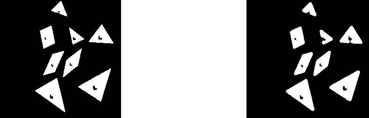
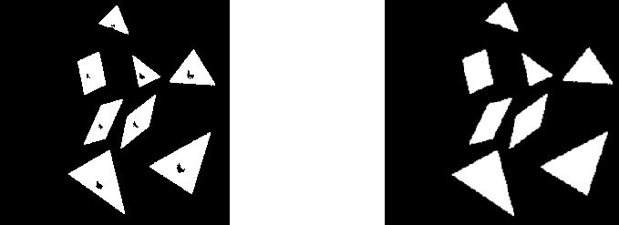

## Introduction

The mathematical morphology’s main field is Image Processing. It allows to use particularly filtering, segmentation and quantification tools **POUR FAIRE INSERER BLABLA**. Since it’s emergence in 1964, it knows a growing success and constitues a part of many Image Processing softwares yet.
The main purpose of mathematical morphology is to study or process a set with an other set called structuring element, wich is used as a probe. For each position of this structing element, a look is taken about its ability to touch or be inclued on the main set. The result of this process is an output set.
This involves a loss of information, but also a great elimination of structures that do not fits to certains criteria such as width or volume.
For the purposes of object or defect identification required in industrial vision applications, the operations of mathematical morphology are more useful than the convolution operations employed in signal processing because the morphological operators relate directly to shape.

## Material & Methods

### Hit-or-Miss

### Dilate & Erode

### Opening and Closing

Opening and closing are two secondary operations that play an important role in morphological image processing. Those two secondary operations could be defined as the combination of erosions and dilations and since they are derived from eroding and dilate they posses the same limits as the original technique which means it can only be applied to binary images (or a graylevel image in particular cases). The general objectives of those two operations are quite simple: making an image as smooth as possible without size change (or at least limited).
Let's take a closer look to the opening operation.

The opening technique consist of an erosion followed by a dilation using the same structuring element for both operations

**Equation.10: Mathematical definition of the opening morphological transformation** 
OOOOOOOOOOOOOOOOOOOOOOOOOOORRRRRRRRRRRRRRRRRRRR ??????
**Equation.10: Mathematical definition of the morphological transformation opening** 

In a simple way opening will have for effect to opens black holes inside white regions and separates touching white regions (in the case that the objects are bright on a dark foreground), which will have to effect the removal of capes, isthmus and islands smaller than the structuring element.
Here is a pratical application :

**Fig.10a: Original image before the Opening operation**
**Fig.10b: Result of the Opening operation on fig.10 using as a structuring element a disk of size 7**

As we can see in fig. 11 some black areas that were inside white figures have been connected with the outside due to some foreground pixel removal.
We can think of that in the following way: first we do the erosion, which is shrinking the boundaries of your objects. After that we perform dilation, which is expanding the boundaries of your objects. Because small ones were removed in erosion step you will bring back biggest elements.

Closing is the dual of opening and can be described mathemacaly with :

**Equation.11: Mathematical definition of the closing morphological transformation** 

OOOOOOOOOOOOOOOOOOOOOOOOOOORRRRRRRRRRRRRRRRRRRR ??????

**Equation.11: Mathematical definition of the morphological transformation closing** 

This could be translated as: a closing is a dilation followed by an erosion using the same structuring element for both operations
Closing is similar in some ways to dilation in that it tends to enlarge the boundaries foreground (bright) regions in an image (and shrink background color holes in such regions)

Let's use once more a pratical application : 

**Fig.12a: Original image before the Closing operation**
**Fig.12b: Result of the Closing operation on fig.10 using as a structuring element a disk of size 7**

We can observe that closing have the opposite effect of opening, instead of opening the black areas inside ours white figures, closing closes them which have for effect to make them disappear.
It's important to note that opening and closing are less destructive of the original boundary shape than erode and dilate.

### Skeletonize

### EDM

### UEP with structuring element

The principal use of Opening  is to remove small bright spots (i.e. “salt”) and connect small dark cracks in the case that the objects are bright on a dark foreground. Compared to a simple Erosion it's less destructive on the edges.

## Results

### Hit-or-Miss

### Dilate

### Erode

### Open

### Close

### Skeletonize

### EDM

### UEP with structuring element

## Discussion

## Conclusion

## References

