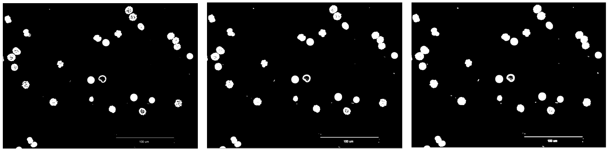

## Introduction

The mathematical morphology’s main field is Image Processing. It allows to use particularly filtering, segmentation and quantification tools **POUR FAIRE INSERER BLABLA**. Since it’s emergence in 1964, it knows a growing success and constitues a part of many Image Processing softwares yet.
The main purpose of mathematical morphology is to study or process a set with an other set called structuring element, wich is used as a probe. For each position of this structing element, a look is taken about its ability to touch or be inclued on the main set. The result of this process is an output set.
This involves a loss of information, but also a great elimination of structures that do not fits to certains criteria such as width or volume.
For the purposes of object or defect identification required in industrial vision applications, the operations of mathematical morphology are more useful than the convolution operations employed in signal processing because the morphological operators relate directly to shape.

Augmentation nb de données -> Besoin d'automatisation. (transition image processing)

## Material & Methods

### Hit-or-Miss
Hit or miss is what could be defined as the basic operation of the morphological area of image processing. It is used to detect occurrences given binary patterns in fixed orientations. It can be used to look for several patterns (or alternatively, for the same pattern in several orientations) simply by running successive transforms using different structuring elements, and then running OR operation between all the results. Therefore, Most of the other morphological operations are derived from this notion(opening, closing, erosion, dilation...).
If any "on" pixels of the image to process' targeted area is covered by "on" pixel of the structuring element, it is called "hit".
If none of the image that have to be processed' "on" pixel in a targeted area is covered by a "on" pixel or the structuring element, it is called "miss". 
If all "on" pixels on structuring element is cover all "on" pixels of an image to process targeted area, it is called "fit".
In general, the hit or miss transform is defined as :

With the condition that B1 ∩ B2 = Ø, because if B1 is not a negative mask of B2, the hit-miss transform would result in the empty set.

### Dilate & Erode

The dilation operator takes two pieces of data as inputs. The first one is the image which is going to be dilated and the second one is the structuring element. Thus, the tructuring element determines the precise effect of the dilation on the first image.

It mathematically goes like this :

In one hand, X is the set of Euclidean coordinates which corresponds to the image that has to be dilated. In an other hand, S is the set of Euclidean coordinates for the structuring element. o cooresponds to the origin of S and the translation of the structuring element upon the image that have to be processed is called So. The the dilatation of X by S then correspond to the set of corresponding points between o and X. In an other way, it corresponds to the set of all points o such that the intersection of So with X is non-empty.

As an example of binary dilation, suppose that the structuring element is a 3×3 square, with the origin at its center, as shown in Figure 1. Note that in this and subsequent diagrams, foreground pixels are represented by 1's and background pixels by 0's.

**Figure 1 : A 3×3 square structuring element**

To compute the dilation of a binary input image by this structuring element, we consider each of the background's pixels in the input image that has to be precessed. For each of those, the structuring element is superimposed upon the input image so that the origin of the structuring element matches with image to be processed's pixel position. If at least one pixel in the structuring element matches with a foreground pixel in the image underneath, then the input pixel is set to the foreground value. If all the corresponding pixels in the image are background, however, the input pixel is left at the background value.

For our example 3×3 structuring element, the effect of this operation is to set to the foreground color any background pixels that have a neighboring foreground pixel. Such pixels must lie at the edges of white regions, and so the practical upshot is that foreground regions grow (and holes inside a region shrink).

**Fig.8: Result of the Dilate operation on 8 using as a structuring element a disk of 3 by 3 size. This operation is done 2 times in a row**

The erosion operator is the dilatiation operator's dual. Indeed, each of the foreground pixels in the input image in turn are considered. For each foreground pixel we superimpose the structuring element on top of the input image so that the origin of the structuring element coincides with the input pixel coordinates. If for every pixel in the structuring element, the corresponding pixel in the image underneath is a foreground pixel, then the input pixel is left as it is. If any of the corresponding pixels in the image are background, however, the input pixel is also set to background value. **A MODIFIER**

For our example 3×3 structuring element, the effect of this operation is to remove any foreground pixel that is not completely surrounded by other white pixels (assuming 8-connectedness). Such pixels must lie at the edges of white regions, and so the practical upshot is that foreground regions shrink (and holes inside a region grow). **A MODIFIER**

**Fig.9: Result of the Erode operation on 8 using as a structuring element a disk of 3 by 3 size. This operation is done 2 times in a row**

### Opening and Closing

Opening and closing are two secondary operations that play an important role in morphological image processing. Both could be defined as the combination of erosions and dilations and since they are derived from eroding and dilate they posses the same limits as the original techniques which means they can only be applied to binary images (or a graylevel image in particular cases). The general aims of those two operations are quite simple: making an image as smooth as possible without size change (or at least limited).
Let's take a closer look to the opening operation.

The opening technique consist of an erosion followed by a dilation using the same structuring element for both operations

**Equation.10: Mathematical definition of the opening morphological transformation** 

In a simple way opening will have for effect to opens black holes inside white regions and separates touching white regions (in the case that the objects are bright on a dark foreground).It will have as effect the removal of capes, isthmus and islands smaller than the structuring element.
Here is a pratical application :

**Fig.10: Result of the Opening operation on fig.10 using as a structuring element a disk of 3 by 3 size**

As we can see in fig. 11 some black areas that were inside white figures have been connected with the outside due to some foreground pixel removal.
Here is an explanation : the erosion is done first, which is shrinking the boundaries of your objects. After that we perform dilation, which is expanding the boundaries of the objects. Thus, because small ones were removed in erosion step, bring back biggest elementsare brought back.

Closing is the dual of opening and can be described mathemacaly with :

**Equation.11: Mathematical definition of the closing morphological transformation** 

This could be described like this : closing is a dilation followed by an erosion using the same structuring element for both operations
Closing is similar in some ways to dilation in that it tends to enlarge the boundaries foreground (bright) regions in an image (and shrink background color holes in such regions).

Let's use once more a pratical application : 

**Fig.12: Result of the Closing operation on fig.10 using as a structuring element a disk of 3 by 3 size **

We can observe that closing have the opposite effect of opening : instead of opening the black areas inside our white figures, closing closes them which have for effect to make them disappear.
It is important to note that opening and closing are less destructive of the original boundary shape than erode and dilate.

### Skeletonize

Skeletonization allows the user to reduce a focused region from a binary image to its skeletal remnant. Indeed, most of the foreground pixels are throwwed when the connectivity is concerved. 
Skeletonization is a process for reducing foreground regions in a binary image to a skeletal remnant that largely preserves the extent and connectivity of the original region while throwing away most of the original foreground pixels. To see how this works, imagine that the foreground regions in the input binary image are made of some uniform slow-burning material. Light fires simultaneously at all points along the boundary of this region and watch the fire move into the interior. At points where the fire traveling from two different boundaries meets itself, the fire will extinguish itself and the points at which this happens form the so called `quench line'. This line is the skeleton. Under this definition it is clear that thinning produces a sort of skeleton.
The skeleton/MAT can be produced in two main ways. The first is to use some kind of morphological thinning that successively erodes away pixels from the boundary (while preserving the end points of line segments) until no more thinning is possible, at which point what is left approximates the skeleton. The alternative method is to first calculate the distance transform of the image. The skeleton then lies along the singularities (i.e. creases or curvature discontinuities) in the distance transform. This latter approach is more suited to calculating the MAT since the MAT is the same as the distance transform but with all points off the skeleton suppressed to zero.
Just as there are many different types of distance transform there are many types of skeletonization algorithm, all of which produce slightly different results. However, the general effects are all similar, as are the uses to which the skeletons are put.

The skeleton is useful because it provides a simple and compact representation of a shape that preserves many of the topological and size characteristics of the original shape. Thus, for instance, we can get a rough idea of the length of a shape by considering just the end points of the skeleton and finding the maximally separated pair of end points on the skeleton. Similarly, we can distinguish many qualitatively different shapes from one another on the basis of how many `triple points' there are, i.e. points where at least three branches of the skeleton meet.

In addition, to this, the MAT (not the pure skeleton) has the property that it can be used to exactly reconstruct the original shape if necessary.

As with thinning, slight irregularities in a boundary will lead to spurious spurs in the final image which may interfere with recognition processes based on the topological properties of the skeleton. Despurring or pruning can be carried out to remove spurs of less than a certain length but this is not always effective since small perturbations in the boundary of an image can lead to large spurs in the skeleton.

Note that some implementations of skeletonization algorithms produce skeletons that are not guaranteed to be continuous, even if the shape they are derived from is. This is due to the fact that the algorithms must of necessity run on a discrete grid. The MAT is actually the locus of slope discontinuities in the distance transform. **A MODIF**

### EDM
The map indicates, for each pixel in the objects (or the background) of the originally binary picture, the shortest distance to the nearest pixel in the background (or the objects).
### UEP with structuring element

## Results

### Hit-or-Miss

### Dilate

### Erode

### Open

### Close

### Skeletonize

### EDM

### UEP with structuring element

## Discussion

## Conclusion

## References

