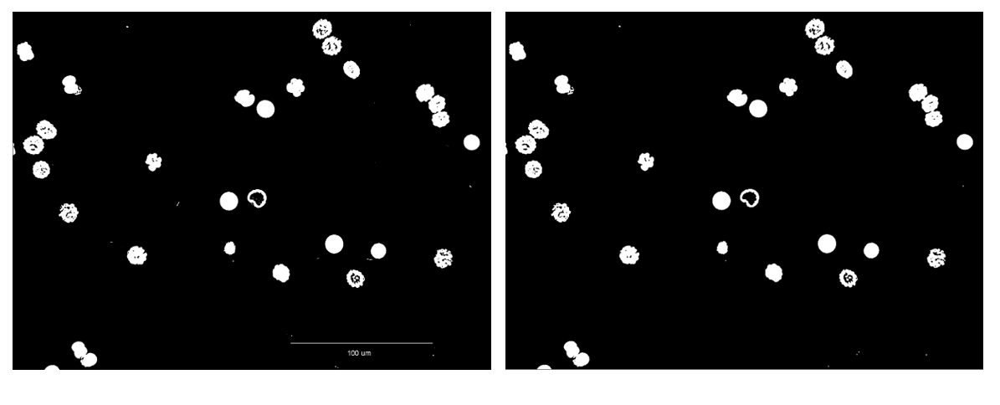

## Introduction

The mathematical morphology’s main field is Image Processing. It allows to use particularly filtering, segmentation and quantification tools **POUR FAIRE INSERER BLABLA**. Since it’s emergence in 1964, it knows a growing success and constitues a part of many Image Processing softwares yet.
The main purpose of mathematical morphology is to study or process a set with an other set called structuring element, wich is used as a probe. For each position of this structing element, a look is taken about its ability to touch or be inclued on the main set. The result of this process is an output set.
This involves a loss of information, but also a great elimination of structures that do not fits to certains criteria such as width or volume.
For the purposes of object or defect identification required in industrial vision applications, the operations of mathematical morphology are more useful than the convolution operations employed in signal processing because the morphological operators relate directly to shape.

Augmentation nb de données -> Besoin d'automatisation. (transition image processing)

## Material & Methods

### Hit-or-Miss
Hit or miss is what could be defined as the basic operation of the morphological area of image processing. It is used to detect occurrences given binary patterns in fixed orientations. It can be used to look for several patterns (or alternatively, for the same pattern in several orientations) simply by running successive transforms using different structuring elements, and then running OR operation between all the results. Therefore, Most of the other morphological operations are derived from this notion(opening, closing, erosion, dilation...).
If any "on" pixels of the image to process' targeted area is covered by "on" pixel of the structuring element, it is called "hit".
If none of the image that have to be processed' "on" pixel in a targeted area is covered by a "on" pixel or the structuring element, it is called "miss". 
If all "on" pixels on structuring element is cover all "on" pixels of an image to process targeted area, it is called "fit".
In general, the hit or miss transform is defined as :

With the condition that B1 ∩ B2 = Ø, because if B1 is not a negative mask of B2, the hit-miss transform would result in the empty set.

### Dilate & Erode

The dilation operator takes two pieces of data as inputs. The first one is the image which is going to be dilated and the second one is the structuring element. Thus, the tructuring element determines the precise effect of the dilation on the first image.

It mathematically goes like this :

In one hand, X is the set of Euclidean coordinates which corresponds to the image that has to be dilated. In an other hand, S is the set of Euclidean coordinates for the structuring element. o cooresponds to the origin of S and the translation of the structuring element upon the image that have to be processed is called So. The the dilatation of X by S then correspond to the set of corresponding points between o and X. In an other way, it corresponds to the set of all points o such that the intersection of So with X is non-empty.

As an example of binary dilation, suppose that the structuring element is a 3×3 square, with the origin at its center, as shown in Figure 1. Note that in this and subsequent diagrams, foreground pixels are represented by 1's and background pixels by 0's.

**Figure 1 : A 3×3 square structuring element**

To compute the dilation of a binary input image by this structuring element, we consider each of the background's pixels in the input image that has to be precessed. For each of those, the structuring element is superimposed upon the input image so that the origin of the structuring element matches with image to be processed's pixel position. If at least one pixel in the structuring element matches with a foreground pixel in the image underneath, then the input pixel is set to the foreground value. If all the corresponding pixels in the image are background, however, the input pixel is left at the background value.

For our example 3×3 structuring element, the effect of this operation is to set to the foreground color any background pixels that have a neighboring foreground pixel. Such pixels must lie at the edges of white regions, and so the practical upshot is that foreground regions grow (and holes inside a region shrink).

**Fig.8: Result of the Dilate operation on 8 using as a structuring element a disk of 3 by 3 size. This operation is done 2 times in a row**

The erosion operator is the dilatiation operator's dual. Indeed, each of the foreground pixels in the input image in turn are considered. For each foreground pixel we superimpose the structuring element on top of the input image so that the origin of the structuring element coincides with the input pixel coordinates. If for every pixel in the structuring element, the corresponding pixel in the image underneath is a foreground pixel, then the input pixel is left as it is. If any of the corresponding pixels in the image are background, however, the input pixel is also set to background value. **A MODIFIER**

For our example 3×3 structuring element, the effect of this operation is to remove any foreground pixel that is not completely surrounded by other white pixels (assuming 8-connectedness). Such pixels must lie at the edges of white regions, and so the practical upshot is that foreground regions shrink (and holes inside a region grow). **A MODIFIER**

**Fig.9: Result of the Erode operation on 8 using as a structuring element a disk of 3 by 3 size. This operation is done 2 times in a row**

### Opening and Closing

Opening and closing are two secondary operations that play an important role in morphological image processing. Both could be defined as the combination of erosions and dilations and since they are derived from eroding and dilate they posses the same limits as the original techniques which means they can only be applied to binary images (or a graylevel image in particular cases). The general aims of those two operations are quite simple: making an image as smooth as possible without size change (or at least limited).
Let's take a closer look to the opening operation.

The opening technique consist of an erosion followed by a dilation using the same structuring element for both operations

**Equation.10: Mathematical definition of the opening morphological transformation** 

In a simple way opening will have for effect to opens black holes inside white regions and separates touching white regions (in the case that the objects are bright on a dark foreground).It will have as effect the removal of capes, isthmus and islands smaller than the structuring element.
Here is a pratical application :

**Fig.10: Result of the Opening operation on fig.10 using as a structuring element a disk of 3 by 3 size**

As we can see in fig. 11 some black areas that were inside white figures have been connected with the outside due to some foreground pixel removal.
Here is an explanation : the erosion is done first, which is shrinking the boundaries of your objects. After that we perform dilation, which is expanding the boundaries of the objects. Thus, because small ones were removed in erosion step, bring back biggest elementsare brought back.

Closing is the dual of opening and can be described mathemacaly with :

**Equation.11: Mathematical definition of the closing morphological transformation** 

This could be described like this : closing is a dilation followed by an erosion using the same structuring element for both operations
Closing is similar in some ways to dilation in that it tends to enlarge the boundaries foreground (bright) regions in an image (and shrink background color holes in such regions).

Let's use once more a pratical application : 

**Fig.12: Result of the Closing operation on fig.10 using as a structuring element a disk of 3 by 3 size**

We can observe that closing have the opposite effect of opening : instead of opening the black areas inside our white figures, closing closes them which have for effect to make them disappear.
It is important to note that opening and closing are less destructive of the original boundary shape than erode and dilate.

### Skeletonize

Skeletonization (also called "Medial Axis Transform" or MAT) allows the user to reduce a focused region from a binary image to its skeletal remnant. Indeed, most of the foreground pixels are throwwed when the connectivity is concerved. 
This process is mostly compared as an explanation to a slow-burning material. Fire is set simultaneously to all the boundary of the area of interest. This fire slowly moves into the interior of the area. A trace remains at each point when the fire coming from each area meets itself. This trace is called "quench line" and represents the skeleton of the area.
The skeleton/MAT can be produced in two main waysusing the erode operator or the distance transform. The first successively erodes away pixels from the boundary (while preserving the end points of line segments) until no more thinning is possible whereas the second calculates the distance transform of the image. The skeleton then lies along the singularities in the distance transform. The latter approach seems to be more adapted to the MAT calculation. Indeed, the MAT is the same as the distance transform but with all points off the skeleton suppressed to zero.
 Whether differents skeletonization algorithm exist, the general effects are all similar, as are the uses to which the skeletons are put.

The skeleton aims to provide a simple representation of a shape that preserves many of the topological and size characteristics of the original. Thus, for instance, we can get a rough idea of the length of a shape by considering just the end points of the skeleton and finding the maximally separated pair of end points on the skeleton. Similarly, we can distinguish many qualitatively different shapes from one another on the basis of how many 'triple points' there are, i.e. points where at least three branches of the skeleton meet.

In addition, to this, the MAT  has the property that it can be used to exactly reconstruct the original shape if necessary.

As with thinning, slight irregularities in a boundary may interfere with recognition processes based on the topological properties of the skeleton. 

### EDM
The map indicates, for each pixel in the objects (or the background) of the originally binary picture, the shortest distance to the nearest pixel in the background (or the objects).The result of the transform is a graylevel image that looks similar to the input image, except that the graylevel intensities of points inside foreground regions are changed to show the distance to the closest boundary from each point.

One way to think about the distance transform is to first imagine that foreground regions in the input binary image are made of some uniform slow burning inflammable material. Then consider simultaneously starting a fire at all points on the boundary of a foreground region and letting the fire burn its way into the interior. If we then label each point in the interior with the amount of time that the fire took to first reach that point, then we have effectively computed the distance transform of that region. Figure 1 shows a distance transform for a simple rectangular shape.
There are several different sorts of distance transform, depending upon which distance metric is being used to determine the distance between pixels. The example shown in Figure 1 uses the `chessboard' distance metric but both the Euclidean and `city block' metrics can be used as well.

Even once the metric has been chosen, there are many ways of computing the distance transform of a binary image. One intuitive but extremely inefficient way of doing it is to perform multiple successive erosions with a suitable structuring element until all foreground regions of the image have been eroded away. If each pixel is labeled with the number of erosions that had to be performed before it disappeared, then this is just the distance transform. The actual structuring element that should be used depends upon which distance metric has been chosen. A 3×3 square element gives the `chessboard' distance transform, a cross shaped element gives the `city block' distance transform, and a disk shaped element gives the Euclidean distance transform. Of course it is not actually possible to generate a good disk shaped element on a discrete grid on a small scale, but there are algorithms that vary the structuring element on each erosion so as to approximate a circular element.

The distance transform can be calculated much more efficiently using clever algorithms in only two passes (e.g. Rosenfeld and Pfaltz 1968). This algorithm, which is based on recursive morphology, will not be described here.

### UEP with structuring element

Ultimate eroded point (or UEP) is derived from the erosion operator and is defined as the last point that would be present after recursively erodes until the last pass before the object would be visible. 
In order to apply multiple UEP on an image, each object is considered separately, which makes possible to use different numbers of erosions for each object and so having the ultimate eroded point not only for an image but for each object which is useful for cells images for example. 

The ultimate erode point is represented as follow :

In an image, the algorithm will search for the brightest pixel for each objet and be sure that none of is neighbors are as bright as it. If it is the sole point, then it will be the only one to be part of the UEP, if there are multiple pixels of the same object, then the center of the brightest pixels will be used. Furthermore, in order to be categorized as a UEP, the determined pixel besides being the brightest need to be a point that is equidistant from at least two (but usually three) boundary locations. In order to find the brightest point, the UEP method uses the peaks or local maxima of the EDM.
Usualy,The Ultimate eroded point operation is used as a marker for objects locations

## Results

This section will be dedicated to the results obtained using the default operations in ImageJ and if there are available some third party plugins. The image used is one of the sample available by default in ImageJ which is : Embryos. The original image will always be in binary mode.

### Erode and Dilate

The erosion and dilates methods have been using the default functions available in ImageJ and with plugins created by the Institut Jean-Pierre Bourgin - INRA(MorphoLibJ). The original file must be a binary image, the final one will be of the same type. In ImageJ, we can't select a specific structuring element (or should i say we didn't find ---to be safe???? to debate-----)this one being a disk of size 3 whereas the MorphoLibJ plugin let the choice to the user.

**Fig.12: Result of the erode operation using as a structuring element a disk of 3 by 3 size. Left : Original image, middle : made with ImageJ default function, right : made with MorphoLibJ plugin**

As we can see some black areas that were inside white figures have been connected with the outside due to some foreground pixel removal. This is due to the fact that some foreground pixel have been removed (due to not being surrounded by other foreground pixels). Moreover, the results seems to be the same whatever we use one plugin or the other.
(peut etre faire une image avec une strucruting element COMPLETEMENT DIFF pour montrer que le kernel joue son role??)

The same results have been obtained by the dilation operation as we can see :

**Fig.13: Result of the dilation operation using as a structuring element a disk of 3 by 3 size. Left : Original image, middle : made with ImageJ default function, right : made with MorphoLibJ plugin**

This time, it's background pixels that are removed in favour of foreground pixels.

### Open and Close

The opening and closing operation take as input a binary image and conserve the same type as output.
As for the erosion and dilation method, we used the same protocol using ImageJ default function and the plugin created by the INRA.
The result obtains for the opening are as follow :

**Fig.14: Result of the opening operation using as a structuring element a disk of 3 by 3 size. Left : Original image, middle : made with ImageJ default function, right : made with MorphoLibJ plugin**

As a reminder, an opening operator could be resumed as an erode followed by a dilation, so in the results we should see some traces of it.
If we look closely, we can see that indeed an erosion has been applied to the picture, but that compared to the fig.12 the black areas are little less more present. We can explain this as the fact that compared to the fig.12, here after the initial erosion, the dilation will have for effect to expand the boundaries of the objects. Thus, because small ones were removed in erosion step, bring back biggest elements are brought back.

The results obtained from the closing operation are the follow :

**Fig.15: Result of the closing operation using as a structuring element a disk of 3 by 3 size. Left : Original image, middle : made with ImageJ default function, right : made with MorphoLibJ plugin**

We can observe that closing have the opposite effect of opening : instead of opening the black areas inside our white figures, closing closes them which have for effect to make them disappear.

It is important to note that opening and closing are less destructive of the original boundary shape than erode and dilate.

### Skeletonize

The Skeletonize is used in order to only have left a skeleton (or the boundary of an object). It takes as input a binary image, and as output a binary too.
Only the default ImageJ default function was used as we didn't find any ready to use plugin that we thought interesting.

The skeletonize operation give an image as follows :

**Fig.15: Result of the closing operation using as a structuring element a disk of 3 by 3 size. Left : Original image, middle : made with ImageJ default function, right : made with MorphoLibJ plugin**

As we can see we have some results to point out.
The cell that only (or almost) contained foreground pixels only leave a little trace as a skeleton this is due to the fact that the lack of background pixels doesn't permit to have a clean skeleton.
The second thing to note is that the more background pixels an object has the more detailed (and complex) a skeleton can be.
In a complex environment like a culture, the skeletonize operation alone cannot be enough to have an idea of the shape.
### EDM

### UEP with structuring element

The Ultimate eroded point is a variant of the erosion method, but instead of eroding only one time it will erode multiple times only one and only point remains for each object present in an image. The input is a binary image, but the output will be a graylevel image.
 The obtained result is:

**Fig.17: Result of the closing operation using as a structuring element a disk of 3 by 3 size. From left to right : original image, the UEP original image wihout process, the UEP original transformed to binary, the transformed UEP with a dilation applied**

After an UEP using the default ImageJ function the output image seems to be only black. In order to check this theory, we transformed the image to binary, and we could already see some points corresponding to the last point that would be eroded for each object. Finally, in order to make the result more usable, we applied a dilation.
As we can, see the more "perfect" the object is, in our case a cell containing only foreground pixels, the more the theoretical ultimate eroded point is valid. However, as soon as we start getting more complex object, we can see that those objects can have multiples ultimate eroded point. This can be explained as the computer is not capable to determine the object in his whole (cause of the background pixels inside the cells) and so is treats which should be considered as one object in multiples, which explain those multiple UEP.

## Discussion

comparer les benchmark pour les differentes transformations et conclure sur le meilleur algo si possible
et argumenter sur le résultat a conserver entre les plugins 

## Conclusion

## References
  

